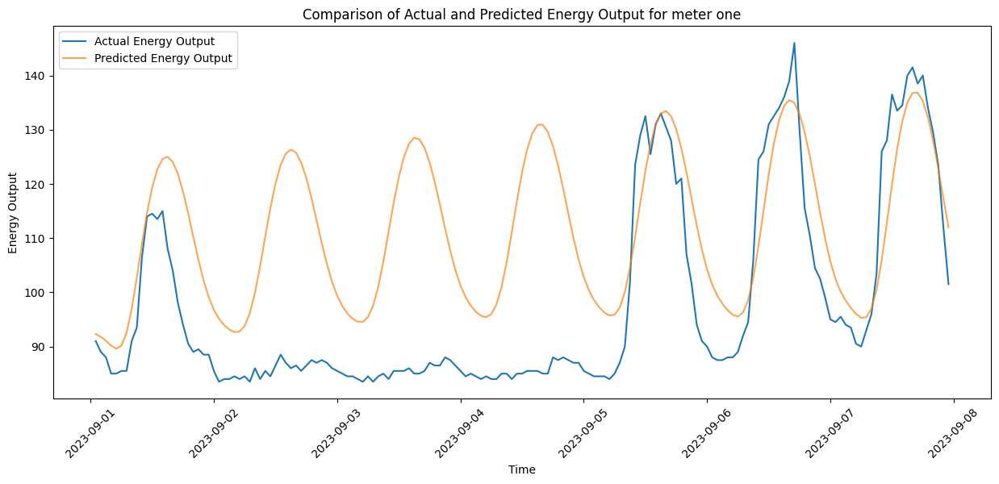

# Predicition of The energy output of parking meters.
  In this project, I used a long short-term memory neural network to make fairly accurate predictions of the hourly energy output of a parking meter. The neural network was trained on hourly energy output from 2018 - 2022. The results of the prediction can be seen below:

